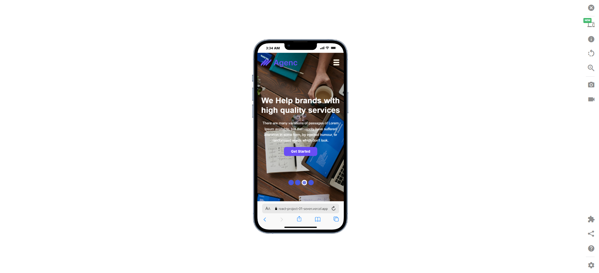
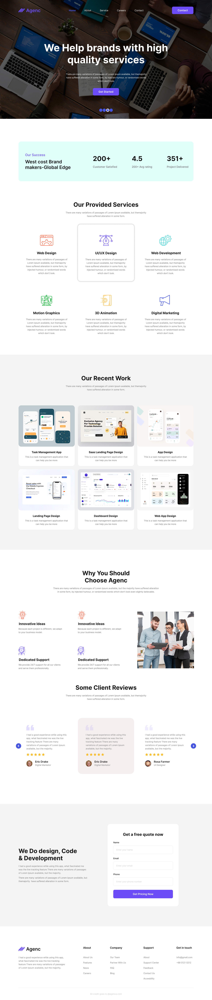

# 🎯 firstReactProject

A clean and modern React project built to practice component concepts and responsive web design.

---

## 👤 Author  
**Saker Ahmed Hridoy**

---

## 🔗 Live Preview  
Live Demo: https://react-project-01-seven.vercel.app/  
GitHub Repo: https://github.com/sakerhridoy

---

## 📝 Description  
This project includes multiple sections like Hero Banner, Services, Portfolio, Client Reviews and Contact form — fully responsive and built using React components.

---

## 🚀 Features  
- ✅ Functional React Components  
- ✅ Modern and clean UI design  
- ✅ Fully responsive layout  
- ✅ Component based architecture  
- ✅ Hosted on Vercel (Fast & Free)

---

## 🛠️ Tech Stack  

| Category | Technology |
|---------|------------|
| Frontend | React JS |
| Build Tool | Vite |
| Styling | CSS |
| Hosting | Vercel |
| Icons | React Icons |
| Slider | React Slick |

---

## 📂 Folder Structure  
```
src
 ┣ Components
 ┃ ┣ Navbar
 ┃ ┣ Banner
 ┃ ┣ Service
 ┃ ┣ Success
 ┃ ┣ Work
 ┃ ┗ Reviews
 ┣ App.jsx
 ┣ main.jsx
 ┗ index.css
```

---

## 🔧 Installation & Setup  
```sh
# Clone the repository
git clone https://github.com/sakerhridoy/firstReactProject.git

# Navigate to project folder
cd firstReactProject

# Install dependencies
npm install

# Run development server
npm run dev
```

---

## 📸 Screenshots

### 📱 Mobile View  
```

```

### 🖥️ Full Website View  
```

```


---

## 📞 Contact  

If you want to collaborate or need help:  
📧 Email: sakerahmedhridoy@gmail.com  
🌐 GitHub: https://github.com/sakerhridoy  

---

### ⭐ Support  
If you like this project, please ⭐ the repo to support the developer!  
Thanks for visiting 😄🚀

